[](https://zenodo.org/badge/latestdoi/538830664)


# traitor

A tool to extract morphological traits from images.

## Publication
Traitor is published in Methods in Ecology and Evolution: [Automated extraction of seed morphological traits from images](https://doi.org/10.1111/2041-210X.14127)

## Installation

### Requirements

Python versions 3.7 to 3.11.
For new users, we recommend Python installation via Conda, an open-source package management system for Python and R, which also includes facilities for environment management. See the official installation guide for further information.

To install Conda (miniconda), visit:
https://conda.io/projects/conda/en/latest/user-guide/install/download.html

### Command-line interface (CLI)

All installation steps and commands should be executed in a command-line interface. We recommend the use of the following CLI:

- Anaconda Prompt (Windows) – This is installed with Miniconda.
- Terminal (Mac)

### Traitor installation via pip

The recommended way to install Traitor is via pip, which enables Traitor to be installed directly from a git repository. Once Conda is installed run the following command in your CLI to install pip:

```bash
conda install git pip
```

Run the following command in your CLI to install Traitor:

```bash
pip install git+https://github.com/TankredO/traitor
```

Test your installation:

```bash
traitor -h
```

## Functionality

### Overview


All Traitor’s functionality can be accessed using the Traitor commandline application in your CLI. Trator is able to process multiple images simultaneously and measures all traits with only three commands: `extract`, `align`, and `measure`.

### Help

Help with information on the commands is easily accessible for Traitor and all its features by adding `-h` after the commands.

#### Examples (enter code in your CLI):

a) Obtain general information about Traitor and its commands:

```bash
traitor -h
```

b) Obtain information on the command extract (same applies to align and measure):

```bash
traitor extract -h
```

### 1. Extract

```
Detect objects and extract their contours/masks from images.

Required options:
  -i, --image_dir DIRECTORY    Directory containing images in PNG format.
                               [required]
  -o, --out_dir DIRECTORY      A directory with the specified name will be
                               created if it does not exist. By default the
                               directory will be created in the current working
                               directory
                               (/Users/tankred/python_projects/traitor).
                               [required]

Output options:
  -m, --masks_output           Generate mask output for every detected object.
  -b, --bbox_output            Extract bounding boxes for every detected object.
  -u, --contour_output         Generate additional output image with contours to
                               easily check the quality of image segmentation.
  -p, --padding INTEGER        Padding around objects for mask and bounding box
                               outputs.  [default: 5]
  --rm_bg                      Set background pixel in bbox output to 0 (black).

Other options:
  -c, --background_color TEXT  Background color. Can be passed as comma-
                               separated list of RGB values (e.g., "12, 52,
                               128") or alternatively as hex color code (e.g.,
                               "#04245f"). By default the most common color
                               range will be assumed to be the background color.
  -t, --n_proc INTEGER         Number of parallel processes to run. Should not
                               be set higher than the number of CPU cores.
  --adaptive                   EXPERIMENTAL: use adaptive segmentation algorithm
  -h, --help                   Show this message and exit.
```

#### Examples (enter code in your CLI):

a) Run code with minimal requirements. Only a mask with detected objects will be created:

```bash
traitor extract -i "images" -o "images_extracted"
```

b) Directories will be searched for and created in the current working directory. Include the path to specify other directories:

```bash
traitor extract -i "Projects/proj_X/images" -o "Projects/proj_X/images_extracted"
```

c) Run command with all output options. In addition to the mask, this generates an output image with contours drawn for a convenient quality assessment of image segmentation. It also extracts bounding boxes for every object detected with a black background and padding of 10 pixels around objects:

```bash
traitor extract -i "images" -o "images_extracted" -u -b --rm_bg -p 10
```

### 2. Align

```bash
Align contours and extract rotated contours from images.

Required options:
  -i, --image_dir DIRECTORY  Input image directory.  [required]
  -m, --mask_dir DIRECTORY   Input mask directory or extraction output
                             directory. Mask files must be PNG files named
                             <IMAGE_NAME>_mask.png; i.e., for an image file
                             "image_1.jpg" the corresponding mask must be named
                             "image_1_mask.png".  [required]
  -o, --out_dir DIRECTORY    Output directory. Will be created if it does not
                             exist. By default a directory with the name
                             "<IMAGE_DIR>_aligned" will be created in the
                             current working directory
                             (/Users/tankred/python_projects/traitor).

Output options:
  -p, --padding INTEGER      Padding around contours.  [default: 5]

Other options:
  -t, --n_proc INTEGER       Number of parallel processes to run. Should not be
                             set higher than the number of CPU cores.  [default:
                             1]
  -h, --help                 Show this message and exit.
```

#### Examples (enter code in your CLI):

a) Run code with minimal requirements:

```bash
traitor align -i "images" -m "images_extracted" -o "images_aligned"
```

b) Directories will be searched for and created in the current working directory. Include the path to specify other directories:

```bash
traitor extract -i "Projects/proj_X/images" -m "Projects/proj_X/images_extracted" -o "Projects/proj_X/images_aligned"
```

### 3. Measure

```bash
Calculate measurements for multiple image-mask pairs.

Required options:
  -i, --input_dir DIRECTORY  Directory containing the outputs of the "traitor
                             align" command.  [required]
  -o, --out_file FILE        Output (CSV) file. By default a file with the name
                             "<INPUT_DIR>_measurements.csv" will be created in
                             the current working directory
                             (/Users/tankred/python_projects/traitor).

Color options:
  -n, --n_colors INTEGER     Number of dominant colors to extract. The specified
                             value should be power of two.  [default: 4]

Other options:
  -t, --n_proc INTEGER       Number of parallel processes to run. Should not be
                             set higher than the number of CPU cores.  [default:
                             1]
  -h, --help                 Show this message and exit.
```

#### Examples (enter code in your CLI):

a) Run code with minimal requirements. This creates the file ‘images_aligned_measurements.csv’ in the current working directory:

```bash
traitor measure -i "images_aligned"
```

b) Directories will be searched for and created in the current working directory. Include the path to specify other directories:

```bash
traitor extract -i "Projects/proj_X/images_aligned" -o "Projects/proj_X/objects_measurements.csv"
```

c) Specify output of 8 dominant colours:

```bash
traitor measure -i "images_aligned" -n 8
```

## Example analysis

In the following, we will explore how Traitor can be applied to automatically extract traits from biological objects.

### 1. Download the data:

The test image dataset (containing four images) is available as ‘sample_images.zip’ at https://doi.org/10.6084/m9.figshare.21206507.

#### Download and unzip from the CLI:

Windows:

```powershell
wget https://figshare.com/ndownloader/files/38302869 -O "sample_images.zip"
mkdir traitor_test
Expand-Archive -Path "sample_images.zip" -DestinationPath "traitor_test"
```

Mac:

```bash
wget https://figshare.com/ndownloader/files/38302869 -O "sample_images.zip"
mkdir traitor_test
unzip sample_images.zip -d "traitor_test"
```

### 2. Extract contours

Extract contours, creating a mask (for align command), contour output to assess the quality of image segmentation, and bounding boxes for every object detected object:

```bash
traitor extract -i "traitor_test" -o "traitor_test_extracted" -u -b
```

The output will look similar to this (image was rotated to improve visualisation):

- **Mask**: 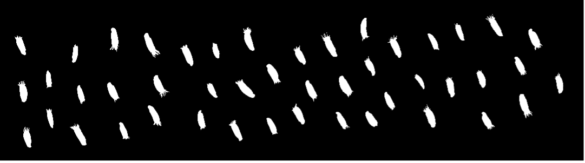
- **Contour output**: 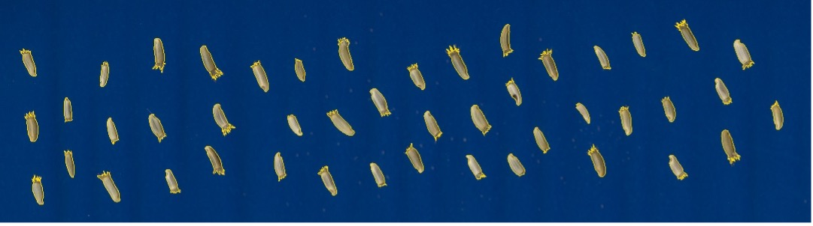
  - Detail of **contour output** showing yellow outline around objects: 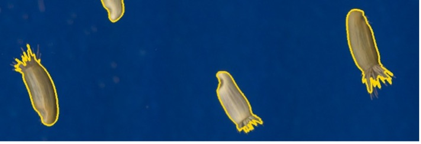
- **Bounding boxes** placed in a subdirectory (only 4 are shown here):<br>
  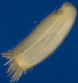
  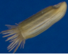
  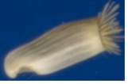
  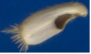

### 3. Align contours

Align contours and extract rotated contours from images

```bash
traitor align -i "traitor_test" -m "traitor_test_extracted" -o "traitor_test_aligned"
```

The output will be placed in 3 folders:

- **Contours**: CSV file with contour coordinates
- **Extractions**: rotated images (only 4 are shown here)<br>
  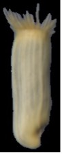
  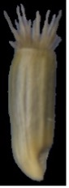
  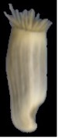
  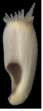
- **Masks**: rotated masks (only 4 are shown here)<br>
  
  
  
  

### 4. Extracts measurements

```bash
traitor measure -i "traitor_test_aligned" -o "traitor_test_measurements.csv"
```

This will write a CSV file with all extracted measurements to `traitor_test_measurements.csv`.
